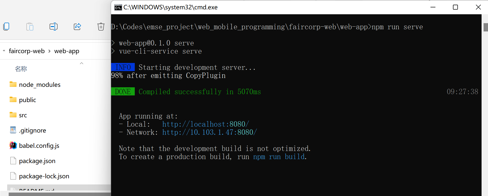
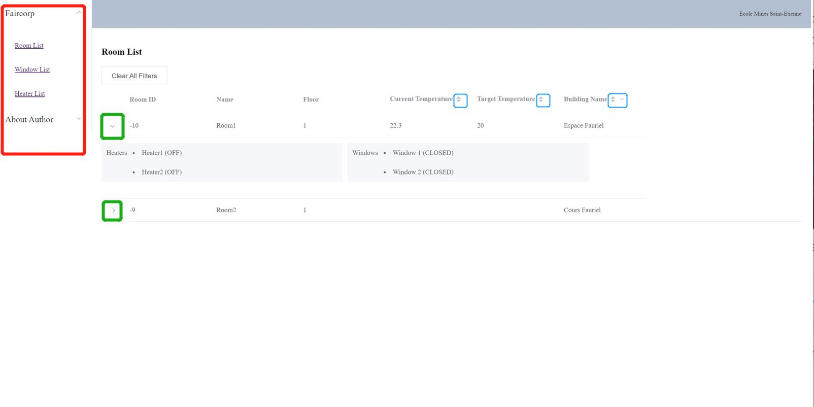
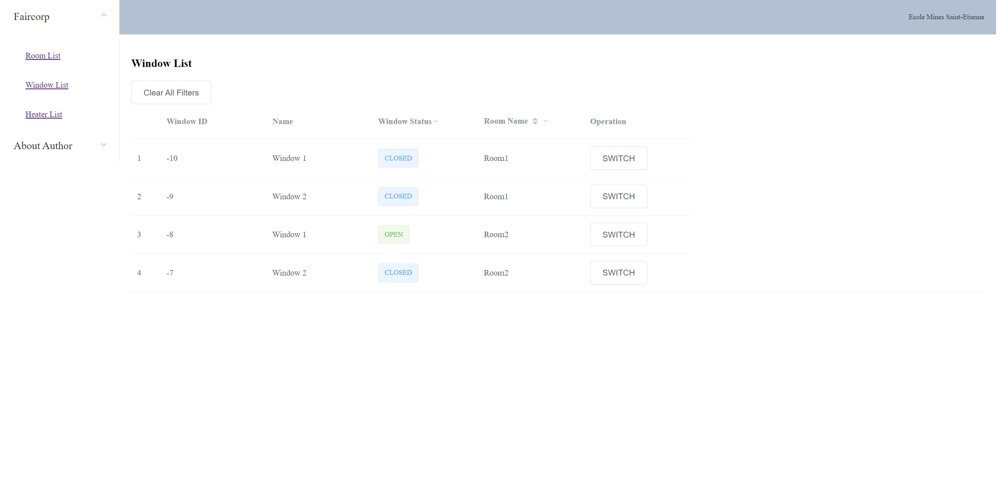
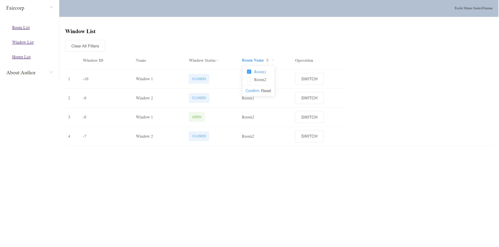
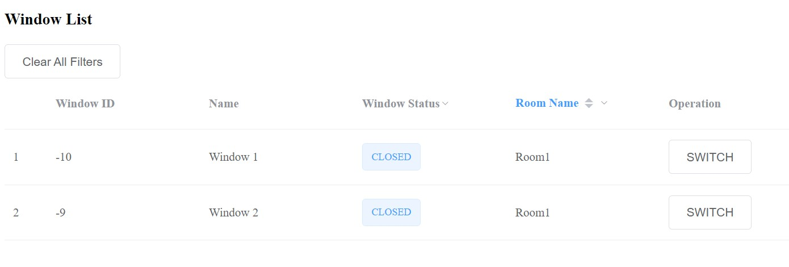
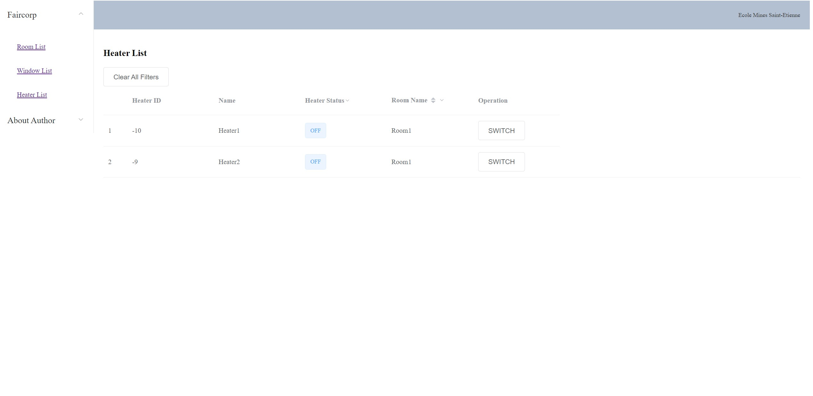

# Prerequisite

- node.js 

  > Download : https://nodejs.org/en/download/,  then check it by using the commands:
  >
  > - `node -v` : the version of node.js
  > - `npm - v` : the version of npm (which is used to manage packets)
  >
  > Or use command line (with administrator access): `npm install`

- Vue

  > Download directly : https://vuejs.org/v2/guide/installation.html
  >
  > Or use  command with `npm` :
  >
  > - `npm install vue`

- [Element](https://element-plus.org/en-US/) ui (a Desktop UI Library)

  > Use command with `npm`:
  >
  > - `npm install -D unplugin-vue-components unplugin-auto-import`
  >
  > Use other methods seeing their website: https://element-plus.org/en-US/guide/quickstart.html

# Start Application

1. In your terminal, go to the directory where the project files is stored, here is the example in my local machine (Window) 

   

   Then use the command to start:

   `npm run serve`

2. Check the web in the url given after you run the command above, here in my case, it's `http://localhost:8080/`

3. Use `ctrl`+ `c` in your terminal to end the process

# A presentation of web

After opening the url indicated above, you should see a page similar as the following, on the left of which you can find a menu list, and on the right the content.

- room list page

  

  - on the left (indicated in the red box): the menu
  - unfolding details (indicated in green box): you can click on it to check more details, more specifically, the windows/heaters in this room and their status
  - sorting / filter (indicated in the blue box) : you can sort the value or use filter to find the specific information you want

- window list page

  

  - in the `operation` column, you can switch the status (`OPEN` or `CLOSED`) of each window

  - sort / filter : here is an example 

     

    By choosing the `Room1`, you can find those ones in `Room1` only ↓

    

- heater list page

  you can do the similar operations as stated above in window list page

  